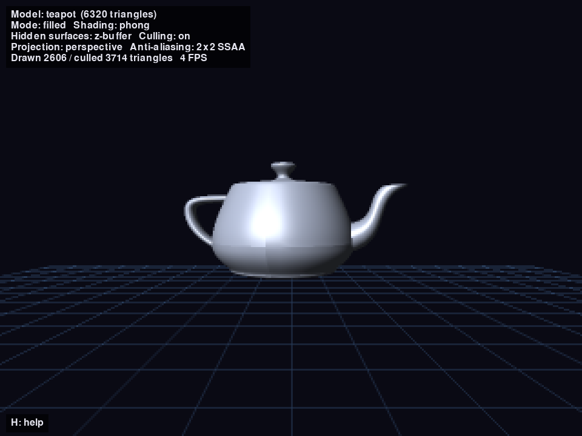
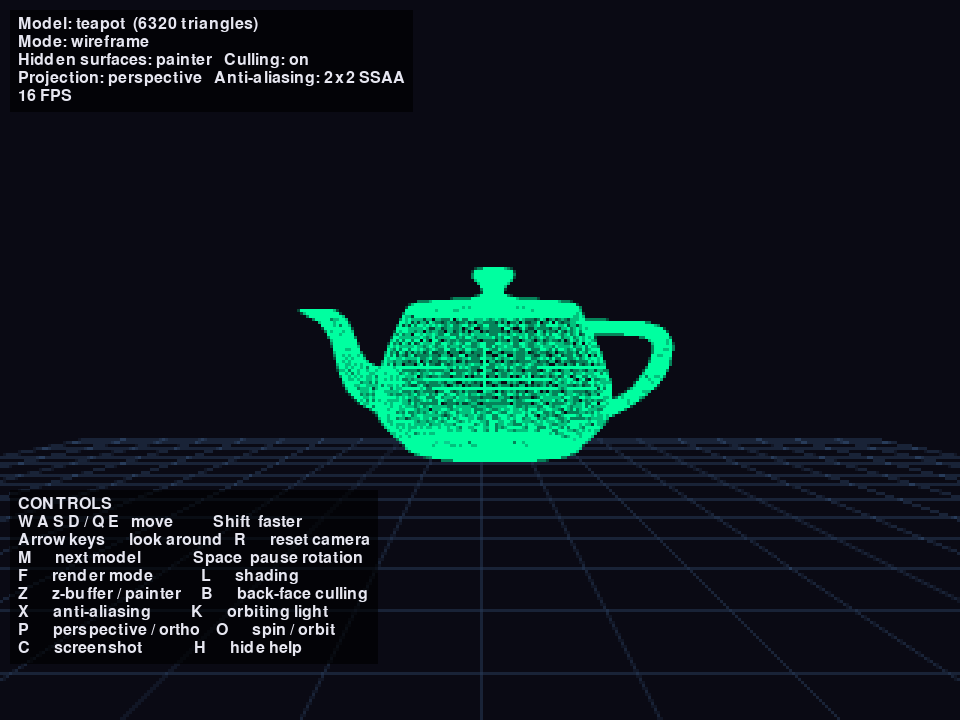
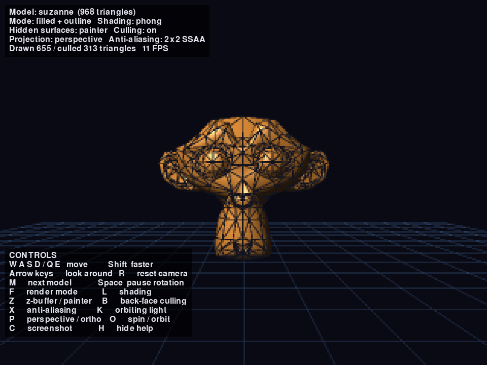
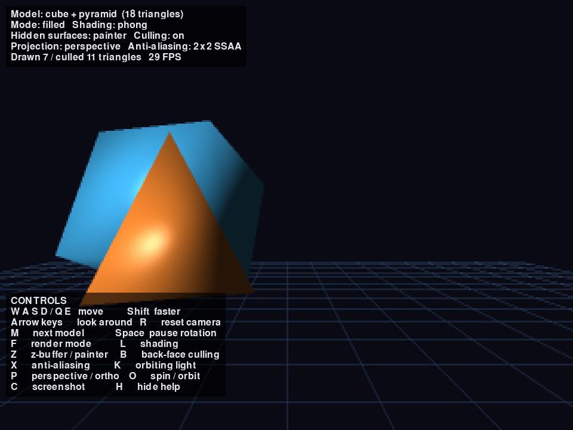
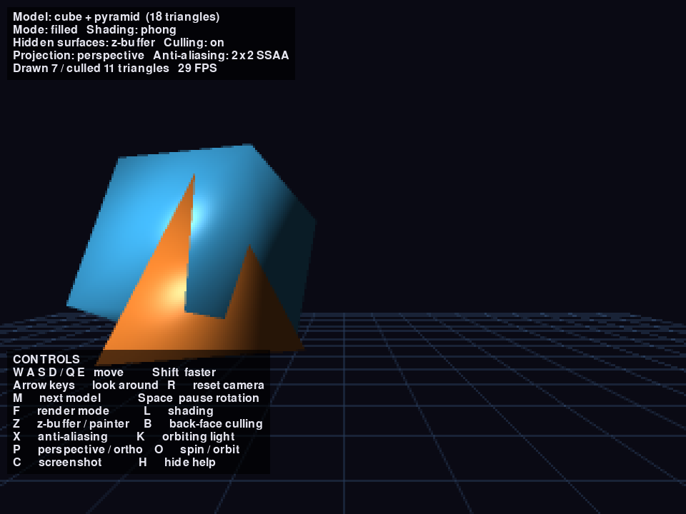
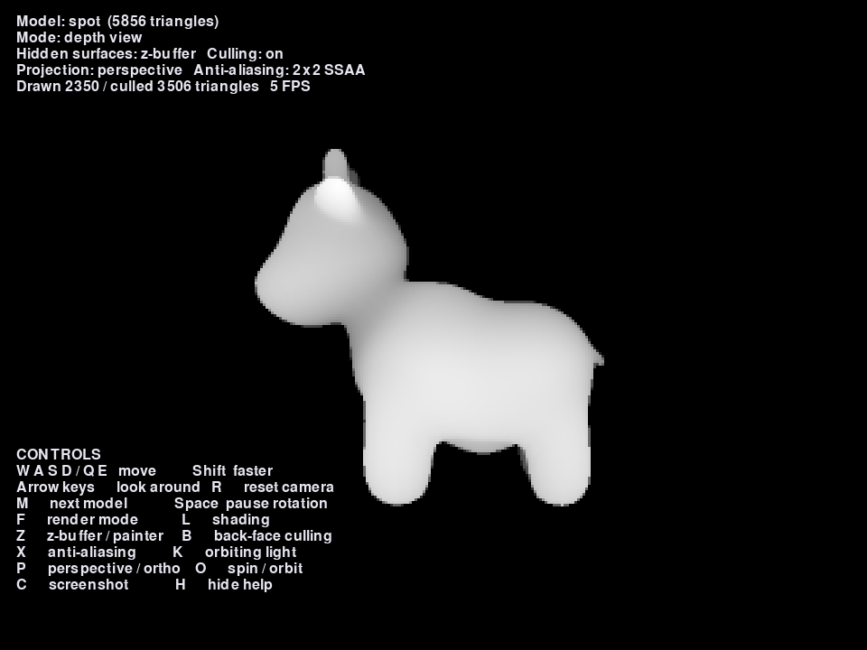
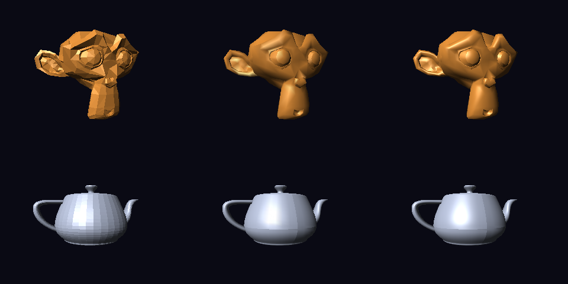
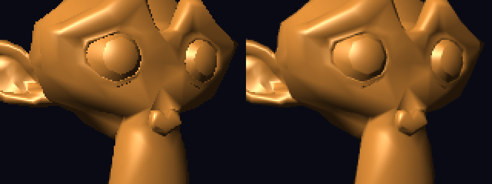

# Rasterization from Scratch: A 3D Software Renderer in Python

A complete 3D rendering pipeline written from scratch, following the same path a GPU takes: 3D models are loaded from files, transformed with 4×4 matrices, projected, clipped, rasterized into pixels, depth-tested and lit. Pygame is used **only** to open a window and display an array of pixels; every pixel of the 3D image is computed by this project's own code.

**Course:** Computer Graphics, mini project
**Main topic:** Rasterization
**Supporting topics:** geometric transformations and projection, mesh representation (graphics data), clipping, hidden surface removal, lighting and shading, anti-aliasing



## Gallery

| | |
|---|---|
|  |  |
| **Wireframe:** Bresenham lines with 3D and 2D clipping | **Filled triangles:** edge-function rasterizer, each polygon outlined |
|  |  |
| **Painter's algorithm:** fails where objects intersect | **Z-buffer:** the same frame, resolved per pixel |
|  |  |
| **Depth view:** the z-buffer itself (near = white) | **Flat, Gouraud and Phong shading** |

## Features

Everything below is implemented by hand; no graphics library draws any part of the 3D image.

| Area | Implemented |
|---|---|
| Line rasterization | Bresenham's algorithm, all 8 octants, integer arithmetic only |
| Transformations | 4×4 homogeneous matrices: translation, rotation (X, Y, Z), scaling |
| Projection | Perspective and orthographic, perspective divide, viewport transform |
| Camera | First-person fly camera, view matrix as the inverse camera transform |
| Clipping | Near-plane clipping in clip space; Liang–Barsky clipping to the screen |
| Models | Wavefront OBJ loader, indexed face sets, fan triangulation, edge extraction |
| Triangle rasterization | Edge functions / barycentric coordinates, pixel-center sampling |
| Visibility | Back-face culling, painter's algorithm, z-buffer |
| Lighting | Blinn-Phong: ambient, diffuse (Lambert), specular (half vector) |
| Shading | Flat, Gouraud and Phong; perspective-correct interpolation |
| Anti-aliasing | 2×2 supersampling (SSAA) |
| Tools | Depth-buffer visualization, depth-correct outlines, on-screen display |

## The pipeline

```mermaid
flowchart LR
    A[OBJ file] --> B[Mesh<br/>vertices + triangles]
    B --> C[Model · View · Projection<br/>4x4 matrices]
    C --> D[Near-plane clipping]
    D --> E[Divide by w<br/>+ viewport]
    E --> F[Back-face culling]
    F --> G[Rasterize triangles<br/>edge functions]
    G --> H[Depth test<br/>z-buffer]
    H --> I[Shading<br/>Blinn-Phong]
    I --> J[Framebuffer]
    J --> K[Optional 2x2<br/>SSAA resolve]
    K --> L[Screen]
```



## How to run

Requires Python 3 with `numpy` and `pygame` (or the drop-in replacement `pygame-ce`).

```bash
python -m venv .venv
.venv\Scripts\python.exe -m pip install pygame-ce numpy     # Windows
.venv\Scripts\python.exe main.py
```

On macOS or Linux, use `.venv/bin/python` instead of `.venv\Scripts\python.exe`.

### Controls

| Key | Action |
|---|---|
| W / A / S / D | Move forward / left / back / right |
| Q / E | Move down / up |
| Shift | Move 3× faster |
| Arrow keys | Look around (yaw and pitch) |
| R | Reset camera |
| M | Switch model (shapes → Suzanne → teapot → Spot the cow) |
| Space | Pause / resume the model rotation |
| F | Render mode: wireframe / filled / filled + outline / depth view |
| Z | Hidden surface removal: z-buffer / painter's algorithm |
| L | Shading: face colors / flat / Gouraud / Phong |
| K | Make the light orbit around the scene (on / off) |
| X | Anti-aliasing: 2×2 supersampling (on / off) |
| H | Show / hide the help overlay |
| B | Back-face culling on / off |
| P | Toggle perspective / orthographic projection |
| O | Toggle the pyramid's transform order (spin in place / orbit) |
| C | Save a screenshot to `screenshots/` (named by time) |
| Esc | Quit |

## Project structure

| File | Responsibility |
|---|---|
| `main.py` | Main loop, input handling, scene setup |
| `math3d.py` | 4×4 matrices: translation, rotation, scaling, projection, viewport |
| `renderer.py` | Framebuffer and rasterization algorithms (everything that writes pixels) |
| `camera.py` | First-person fly camera: position, yaw, pitch, view matrix |
| `lighting.py` | Blinn-Phong reflection model (ambient, diffuse, specular) |
| `obj_loader.py` | Mesh class, Wavefront .obj loader, triangulation, built-in cube and pyramid |
| `models/` | Test models: Suzanne, the Utah teapot, Spot the cow |
| `devlog.md` | Development log: problems found and how they were solved |
| `screenshots/` | Images used in this README |

The work was done in stages, each adding one part of the pipeline and each committed separately to git. The commit history and `devlog.md` record the process, including the bugs found along the way and how they were fixed.

---

# Implementation, stage by stage

## Stage 1: The framebuffer and Bresenham's line algorithm

### The framebuffer
The screen is a discrete grid of pixels, but geometry is continuous. The framebuffer is a `numpy` array of shape `(width, height, 3)` holding one RGB color per pixel. It is rendered at a low internal resolution (320×240) and scaled up 3×, which keeps the pure-Python renderer fast and makes individual pixels visible, so the rasterization is easy to see.

### Bresenham's line algorithm
To draw a line from (x0, y0) to (x1, y1) we must decide which pixels best approximate it. The naive approach computes `y = m·x + b` for every x, which needs floating-point multiplication and rounding per pixel, and leaves gaps on steep lines.

Bresenham's algorithm walks from one endpoint to the other one pixel at a time and keeps an integer **error term** `err` that measures how far the drawn pixels have drifted from the ideal line. At each step it compares `2·err` against `dx` and `dy` to decide whether to step in x, in y, or in both. Only integer additions and comparisons are used, so it is fast and exact. The implementation handles all 8 octants (any slope, any direction) by using step signs `sx` and `sy`.

**Test:** a "spoke" pattern of 24 rotating lines from the center covers every direction and confirms all octants work.

**Bug found:** the stop condition `x0 == x1 and y0 == y1` is never exactly true when the endpoints are floats (which projected 3D points always are), causing an infinite loop. Fix: round the endpoints to integer pixel coordinates before the loop.

---

## Stage 2: The 3D transformation pipeline

Every vertex passes through the same chain before it becomes a pixel:

```
object space --Model--> world space --View--> camera space --Projection--> clip space
  --divide by w--> normalized device coordinates (NDC) --Viewport--> screen pixels
```

### Homogeneous coordinates and 4×4 matrices
Rotation and scaling can be written as 3×3 matrices, but translation cannot: it is an addition, not a multiplication. By writing a point as `(x, y, z, 1)` we can express translation as a 4×4 matrix too:

```
| 1 0 0 tx |   | x |   | x + tx |
| 0 1 0 ty | · | y | = | y + ty |
| 0 0 1 tz |   | z |   | z + tz |
| 0 0 0 1  |   | 1 |   |   1    |
```

Now every transformation is one matrix, and a whole chain collapses into a single matrix computed once per object per frame: `MVP = Projection · View · Model`.

### Rotation matrices
Rotation around the Y axis by angle θ:

```
|  cos θ  0  sin θ  0 |
|    0    1    0    0 |
| -sin θ  0  cos θ  0 |
|    0    0    0    1 |
```

X and Z rotations have the same structure on the other axis pairs. The cube is rotated with `rotate_y(t) · rotate_x(0.7t)`, a combination of Euler-angle rotations.

### Transform order matters (matrix multiplication is not commutative)
Points are column vectors, so in `A · B · p` the matrix **B is applied first**. The pyramid demonstrates this live (key **O**), using the same two matrices in two orders:

- `Translate(1.8, 0, 0) · RotateY(t)`: the pyramid is rotated around its own center first, then moved to the side. Result: **it spins in place**.
- `RotateY(t) · Translate(1.8, 0, 0)`: the pyramid is moved away from the origin first, then rotated around the **world** origin. Result: **it orbits around the center**, like a planet.

This is why a scene graph applies "local" transforms before "parent" transforms.

### Perspective projection
The perspective matrix (field of view 60°, `f = 1 / tan(fov/2)`):

```
| f/aspect  0        0                  0            |
|    0      f        0                  0            |
|    0      0   (far+near)/(near-far)  2·far·near/(near-far) |
|    0      0       -1                  0            |
```

The key is the last row: it copies `-z` into the `w` coordinate. After the matrix, every coordinate is **divided by w** (the perspective divide). Points farther from the camera have a larger `w`, so they shrink toward the center of the screen. That single division is what creates the sense of depth. The z row maps the range [near, far] into [-1, 1], which will be used for the z-buffer in a later stage.

### Orthographic projection
The orthographic matrix only scales and shifts a box of space into the [-1, 1] cube, and leaves `w = 1`. There is no divide by distance, so objects keep the same size at any depth and parallel lines stay parallel. It is used in engineering drawings and 2D games. Key **P** switches between the two so the difference can be seen directly.

### Viewport transform
NDC coordinates are in [-1, 1]. They are mapped to pixels with:

```
screen_x = (x_ndc + 1) / 2 · width
screen_y = (1 - y_ndc) / 2 · height      (flipped, because screen y grows downward)
```

### Clipping
In this stage, edges with an endpoint behind the near plane were simply skipped. Stage 3 replaces this with proper clipping.

---

## Stage 3: An interactive camera and line clipping

### The camera as an inverse transform
A camera is just an object in the world with a position and an orientation. Here it is described by a position and two angles: **yaw** (turning left/right around the Y axis) and **pitch** (looking up/down around the X axis). The camera's own transform in the world is:

```
CameraWorld = T(position) · Ry(yaw) · Rx(pitch)
```

The graphics pipeline, however, always assumes the camera sits at the origin looking down −Z. So instead of moving the camera, we move the **whole world in the opposite direction**. The view matrix is the inverse of the camera's transform:

```
View = CameraWorld⁻¹ = Rx(−pitch) · Ry(−yaw) · T(−position)
```

The inverse of a product reverses the order, and the inverse of a rotation is a rotation by the negative angle. Moving the camera 1 unit to the right is exactly the same as moving everything else 1 unit to the left.

### Moving relative to where you look
Pressing W should move the camera *forward from its own point of view*, not along a fixed world axis. The forward and right directions are the camera's local axes rotated by the yaw:

```
forward = Ry(yaw) · (0, 0, −1) = (−sin yaw, 0, −cos yaw)
right   = Ry(yaw) · (1, 0,  0) = ( cos yaw, 0, −sin yaw)
```

Pitch is clamped to ±89° so the camera cannot flip upside down (at exactly ±90° the yaw axis and the view axis line up and turning becomes ambiguous, a close relative of gimbal lock).

### Frame-rate independent movement
Movement is multiplied by `dt`, the time since the last frame in seconds. Speed is expressed in units per second, so the camera moves at the same real speed whether the renderer runs at 20 or 60 FPS.

### Why clipping became necessary
Once the camera can move, lines can pass behind it or extend far outside the screen. This caused two real problems:

1. **Points behind the camera:** they have `w ≤ 0`. Dividing by a negative `w` flips them to the opposite side of the screen and draws lines that should not exist.
2. **Huge off-screen lines:** a point just in front of the near plane projects to a coordinate like x = 1,000,000. Bresenham would then loop over a million pixels, almost all off-screen, and freeze the program.

The floor grid (lines 20 units long that pass under and behind the camera) triggers both, so the renderer now clips in two steps.

### Step 1: near-plane clipping in 3D (clip space)
Before the perspective divide, each edge is tested against the plane `w = near`. If both endpoints are in front, it is kept. If both are behind, it is dropped. If it crosses the plane, the crossing point is found by linear interpolation:

```
t   = (near − w0) / (w1 − w0)
hit = C0 + t · (C1 − C0)
```

and the part behind the camera is replaced by `hit`. Clipping in clip space (before dividing) is important, because the division is exactly what breaks for points behind the camera.

### Step 2: Liang–Barsky clipping in 2D (screen space)
After projection, each line is clipped to the screen rectangle before Bresenham runs. Liang–Barsky writes the line in parametric form:

```
P(u) = P0 + u · (P1 − P0),    0 ≤ u ≤ 1
```

Each of the four screen edges gives one inequality of the form `u · p_k ≤ q_k`. When `p_k < 0` the line is entering that boundary and `u = q_k / p_k` raises the lower bound `u_enter`; when `p_k > 0` the line is leaving and it lowers the upper bound `u_exit`. If `u_enter > u_exit` the line misses the screen entirely. Otherwise the visible part is `P(u_enter)` to `P(u_exit)`. It needs only four divisions per line and no repeated subdivision, which makes it more efficient than Cohen–Sutherland.

**Result:** Bresenham now only ever walks over visible pixels, so a line that was 1,000,000 pixels long is reduced to at most a few hundred, and the program stays smooth anywhere in the scene.

---

## Stage 4: Loading real 3D models (graphics data)

### Mesh representation: the indexed face set
A 3D model is a surface made of polygons. The naive way to store it is a list of triangles, each with its own three copies of its corner coordinates. Since a typical vertex is shared by about six triangles, that repeats every coordinate about six times, and nothing records that two triangles actually touch.

The renderer uses an **indexed face set** instead, the standard representation used by GPUs and most file formats:

- `vertices`: an (N, 3) array. Each vertex position is stored **once**.
- `triangles`: a (T, 3) array of integer **indices** into the vertex array.
- `edges`: an (E, 2) array of unique edges, used for wireframe drawing.

Besides saving memory, sharing vertices means a transform only has to be computed once per vertex, not once per triangle corner. The renderer takes advantage of this: all vertices are projected in a single matrix multiplication, and then every edge just looks up its two already-projected endpoints.

### The Wavefront OBJ format
OBJ is a plain-text format. The loader handles the lines that matter for geometry:

```
v  x y z          a vertex position
f  1 2 3 4        a face, listing vertex indices (1-based)
```

Details the loader has to deal with, all of which appear in the three test models:

- **Face corner formats:** a corner may be `v`, `v/vt`, `v//vn` or `v/vt/vn` (vertex / texture coordinate / normal). Only the first number, the vertex index, is used for now.
- **1-based and negative indices:** OBJ counts from 1, so 1 is subtracted. Negative indices count backwards from the most recently defined vertex.
- **Polygons with more than 3 corners:** Suzanne is made mostly of quads.

### Triangulation
The rasterizer (next stage) only works with triangles, because a triangle is always flat and always convex, so filling it has no special cases. Every polygon is split with a **fan** from its first corner: a quad `(a, b, c, d)` becomes `(a, b, c)` and `(a, c, d)`. A fan is correct for any convex polygon, which is what modeling tools export.

### Edge extraction
For the wireframe, edges are taken from the **original polygon outlines**, not the triangles, so quads are drawn without their internal diagonal (like Blender's wireframe view). Each edge is stored as `(min(a, b), max(a, b))` in a set, because the edge from a to b and the edge from b to a are the same line, and neighboring faces share it. Without this, every interior edge would be drawn twice.

### Normalization
Models come in arbitrary units and positions (the teapot is about 6 units wide and sits above the origin; Spot is under 2 units). Each model is centered on its bounding box and scaled so its largest side is 2, so every model fits in the same [−1, 1] box and the same camera setup works for all of them.

### The test models

| Model | Vertices | Triangles | Unique edges | Notes |
|---|---|---|---|---|
| Suzanne | 507 | 968 | 1,005 | Blender's mascot, mostly quads, `v//vn` corners |
| Utah teapot | 3,644 | 6,320 | 9,998 | The classic computer graphics test model (1975), plain `v` corners |
| Spot the cow | 2,930 | 5,856 | 8,784 | Uses `v/vt` corners (texture coordinates) |

Models from Alec Jacobson's *common-3d-test-models* collection on GitHub.

### Performance
Projecting all vertices at once with numpy, and converting the result to plain Python lists before the per-edge loop, keeps even the teapot at an interactive frame rate. The remaining cost is Bresenham itself, which runs in pure Python one pixel at a time. This is exactly the work a GPU does in parallel hardware.

---

## Stage 5: Filled triangles

### Why triangles
Every polygon was already split into triangles in Stage 4. A triangle is the ideal primitive to fill: its three corners always lie in one plane, it is always convex, and it can never twist or overlap itself. This is why GPUs rasterize nothing but triangles.

### The edge function
For a directed edge from A to B and a point P:

```
E(A, B, P) = (Bx − Ax)·(Py − Ay) − (By − Ay)·(Px − Ax)
```

This is the 2D cross product of `B − A` and `P − A`. It equals **twice the signed area** of triangle (A, B, P): positive when P is on one side of the line A→B, negative on the other, and zero exactly on the line.

A point P is inside triangle (V0, V1, V2) exactly when it is on the same side of all three edges:

```
w0 = E(V1, V2, P)     w1 = E(V2, V0, P)     w2 = E(V0, V1, P)
inside  ⇔  w0, w1, w2 all have the same sign as the triangle's area E(V0, V1, V2)
```

These three values are also the **barycentric coordinates** of P (after dividing by the total area): each one is the relative area of the sub-triangle opposite a vertex, and they sum to 1. They will be used in the next stages to interpolate depth and color across the triangle.

### The rasterization algorithm
1. Compute the triangle's **bounding box** and clip it to the screen. Triangles completely off-screen are rejected immediately.
2. Test the **center** of every pixel in the box (`x + 0.5, y + 0.5`). Sampling at centers means that two triangles sharing an edge divide the pixels between them without leaving gaps.
3. Color the pixels that pass the inside test.

This is the same approach GPUs use. It is used here instead of the scanline algorithm because every pixel's test is independent of the others: numpy evaluates the whole bounding box in a few array operations, just as a GPU tests many pixels in parallel. The scanline algorithm, by contrast, walks the triangle row by row and is naturally sequential.

### Back-face culling
For a closed object, the triangles facing away from the camera are always hidden behind the ones facing it, so they can be skipped without any visible change.

The test uses **winding order**. The OBJ convention is that the corners of a face are listed counter-clockwise when viewed from outside the object. After projection, a front-facing triangle keeps that order on screen, and a back-facing one appears reversed (clockwise). So the sign of the triangle's screen-space area tells which way it faces, with no normals or 3D math needed. (Because screen y points down, counter-clockwise in the world shows up as a *negative* area on screen.)

The winding of every model was verified by computing its signed volume from the triangles (the divergence theorem): a positive volume means all faces point outward.

**Result:** about half of all triangles are discarded before rasterization. Key **B** turns culling off to compare; the window title shows how many triangles were drawn and culled.

| Model | Triangles | Drawn with culling | Culled |
|---|---|---|---|
| Cube | 12 | 4–6 | 6–8 |
| Suzanne | 968 | ~650 | ~320 |
| Utah teapot | 6,320 | ~2,600 | ~3,700 |
| Spot | 5,856 | ~2,800 | ~3,100 |

(Suzanne keeps more because her eye sockets and ears contain faces that face the camera but are hidden, which culling cannot detect.)

### The painter's algorithm (hidden surface removal, first attempt)
Culling alone is not enough: on a non-convex shape (the teapot's handle and spout, Suzanne's ears) a front-facing triangle can still be hidden behind another front-facing one. The first solution used here is the **painter's algorithm**: the triangles of all objects are gathered in one list, sorted by their average distance from the camera (the clip-space `w`), and painted **from farthest to nearest**, so nearer triangles cover farther ones, the way a painter paints the background first.

### Where the painter's algorithm fails
Sorting whole triangles by one depth value is an approximation, and it visibly breaks in the shapes scene: press **O** so the pyramid orbits **through** the cube. When two objects intersect, part of a triangle is in front and part is behind, and no ordering of whole triangles can be correct. One object's faces pop in front of the other's all at once, instead of cutting through each other. The same problem happens with long triangles whose average depth is misleading, and with cyclic overlaps (A over B over C over A).

The solution is to decide visibility **per pixel instead of per triangle**, which is the z-buffer, implemented in the next stage.

### Colors in this stage
There is no lighting yet, so a solid model with one color would be a flat silhouette. Each original polygon gets its own debug color, spaced around the hue wheel by the golden ratio (0.618…) so neighboring faces always look different. Both triangles of a quad share one color, so Suzanne's quads are visible as quads.

---

## Stage 6: The z-buffer

### The idea
The painter's algorithm decides visibility **per triangle**, and Stage 5 showed that this cannot be correct when objects intersect. The z-buffer (depth buffer) decides visibility **per pixel** instead.

Next to the color buffer, the framebuffer now holds a second array of the same size, `depth`, storing for every pixel the depth of the nearest surface drawn there so far. At the start of each frame it is filled with infinity ("nothing drawn yet"). Then, for every pixel a triangle covers:

```
z = depth of the triangle at this pixel
if z < depth_buffer[x, y]:          # nearer than anything drawn here before?
    depth_buffer[x, y] = z          # remember it
    color_buffer[x, y] = color      # and draw it
else:
    discard                         # hidden behind something already drawn
```

Because every pixel is resolved independently, the triangles can be drawn **in any order**: no sorting is needed at all, and intersecting objects are handled exactly. This is the method every GPU uses.

### Interpolating depth with barycentric coordinates
The rasterizer from Stage 5 already computes the edge functions `w0, w1, w2` for each pixel. Dividing them by the triangle's signed area gives the **barycentric coordinates**:

```
λ0 = w0 / area,   λ1 = w1 / area,   λ2 = w2 / area,     λ0 + λ1 + λ2 = 1
```

Each λ says how much each corner "contributes" to the pixel, so the depth at the pixel is the weighted average of the corner depths:

```
z = λ0·z0 + λ1·z1 + λ2·z2
```

Dividing by the *signed* area also simplified the inside test: all three λ are non-negative inside the triangle, whatever the winding of the triangle on screen.

### Which depth value to store
The value interpolated is the **NDC z** produced by the projection matrix and the divide by w. This choice matters: after the perspective divide, NDC z is a linear function of the screen x and y, so interpolating it with screen-space barycentric coordinates is exact. (Eye-space distance is *not* linear across the screen after perspective projection, so interpolating it this way would give slightly wrong depths.)

### Depth precision is not uniform
NDC z is related to the real distance d by roughly `z ≈ A − B/d`: it changes very quickly close to the camera and very slowly far away. With near = 0.1 and far = 100, about 90% of the whole depth range is used for the first metre in front of the camera. This is why real engines keep the near plane as far out as possible: a near plane that is too small causes **z-fighting**, where two surfaces far from the camera get the same stored depth and flicker.

### Depth view (key F)
The "depth view" mode displays the z-buffer itself as a grayscale image (near = white, far = dark). Because of the non-uniform precision above, showing NDC z directly would make everything look almost the same light gray. So the stored value is first converted back to real distance:

```
d = 2·near·far / (far + near − z·(far − near))
```

and then stretched between the nearest and farthest visible pixel. In orthographic mode NDC z is already linear in distance, so no conversion is needed.

### Outlines that respect depth
In Stage 5 the outline mode drew triangle edges with Bresenham on top of the fill. With the z-buffer, triangles are no longer drawn back to front, so those lines would show edges of hidden triangles through the surface. Instead, the outline is now computed **inside the triangle rasterizer**: the distance from a pixel to an edge is its edge function divided by the edge length,

```
distance_to_edge_i = |w_i| / length(edge_i)
```

and visible pixels closer than 0.8 px to any edge are colored dark. Since this happens after the depth test, only edges of visible surfaces are drawn. (This is the same idea as the "barycentric wireframe" shader technique used on GPUs.)

### Painter's algorithm vs. z-buffer
Key **Z** switches between the two methods live. The difference is clearest in the shapes scene with the orbiting pyramid (key **O**): with the painter's algorithm, the pyramid's faces pop in front of or behind the cube as whole triangles; with the z-buffer, the two objects cut through each other with a clean, pixel-exact intersection line.

| | Painter's algorithm | Z-buffer |
|---|---|---|
| Visibility decided | per triangle | per pixel |
| Needs sorting | yes, every frame | no |
| Intersecting objects | wrong | correct |
| Extra memory | none | one depth value per pixel |
| Extra work | sort T triangles | one comparison per covered pixel |

---

## Stage 7: Lighting and shading


*Left to right: flat, Gouraud and Phong shading, rendered by this project.*

### Normals
Lighting depends on which way a surface faces, described by its **normal**: a unit vector perpendicular to the surface.

- **Face normal:** for a triangle (A, B, C) listed counter-clockwise, `N = (B − A) × (C − A)` points out of the front side. This is the same winding convention used for back-face culling in Stage 5.
- **Vertex normal:** the average of the normals of all faces around a vertex. The raw cross product's length is twice the triangle's area, so summing the un-normalized face normals weights big faces more than thin slivers, which gives smoother results. The result is normalized at the end. This is computed once when a model is loaded.

Normals are transformed to world space with the 3×3 part of the model matrix. That is correct for rotations and uniform scaling, which is all this project uses. With non-uniform scaling, normals must be transformed by the **inverse transpose** of that matrix, otherwise they stop being perpendicular to the surface.

### The Blinn-Phong reflection model
The light is a directional light (like the sun): every point receives light from the same direction `L`. The color of a point combines three terms:

```
color = base · (ambient + kd · max(N·L, 0))  +  white · ks · max(N·H, 0)^shininess
```

- **Ambient** (0.15): a small constant, so surfaces facing away from the light are dark but not pure black. It stands in for light bouncing off other objects.
- **Diffuse** (Lambert's cosine law): a matte surface receives energy proportional to the cosine of the angle between its normal and the light, `N·L`. It looks the same from every viewing angle. Negative values (facing away) are clamped to 0.
- **Specular**: the shiny highlight. It depends on the viewer: `V` points from the surface to the camera and `H = normalize(L + V)` is the **half vector** halfway between light and viewer. The highlight is brightest when the normal lines up with H. Raising `N·H` to a power (the shininess, 32 here) makes the highlight small and sharp. It is white, since highlights reflect the color of the light, not the surface.

Blinn-Phong uses the half vector instead of Phong's original reflection vector `R = 2(N·L)N − L`, because H is cheaper to compute and behaves better at grazing angles. It is the model OpenGL used for its fixed-function lighting.

Lighting is calculated in **world space**, where the light direction and the camera position are both known. Key **K** makes the light orbit around the scene, so the highlights and shadows can be seen moving across the surface.

### Three ways to apply the model (key L)
The same lighting formula gives very different pictures depending on **where** it is evaluated.

**Flat shading.** The formula is evaluated once per triangle, using the face normal at the triangle's center. Every triangle has one color, so the individual facets are clearly visible. It is the cheapest method.

**Gouraud shading (1971).** The formula is evaluated once per **vertex**, using the smooth vertex normals, and the resulting colors are interpolated across the triangle with the barycentric coordinates. The model looks smooth, at almost the same cost as flat shading. Its weakness is the specular highlight: if a highlight falls in the middle of a triangle, none of the three vertices sees it, so it can disappear or appear smeared along the triangle's edges.

**Phong shading (1975).** The **normal** (and the world position) are interpolated across the triangle instead of the color, and the full lighting formula is evaluated at **every pixel**, with the interpolated normal re-normalized first. Highlights are round and sharp and appear wherever they belong, independent of the mesh. It is the most expensive: in pure Python it runs at roughly half the frame rate of Gouraud on the teapot. This per-pixel approach is what GPU fragment shaders do today.

The difference is easiest to see on the teapot with key **K** on: with Gouraud the highlight jumps between vertices, with Phong it slides smoothly across the surface.

### Perspective-correct interpolation
The barycentric coordinates from the rasterizer are measured on the **screen**. Because of the perspective divide, equal steps on screen do not correspond to equal steps on the 3D triangle: the far half of a triangle is squeezed into fewer pixels. Interpolating colors or normals with screen weights directly would distort them. (Depth did not have this problem, because NDC z is itself linear on screen.)

The fix: a value divided by `w`, and `1/w` itself, *are* linear on screen. So for each pixel:

```
weight_i = λ_i / w_i
value    = Σ weight_i · value_i  /  Σ weight_i
```

This is applied to the Gouraud colors and to the Phong normals and positions. It is the same correction GPUs apply to every interpolated attribute, and it matters most for large triangles viewed at an angle, for example the floor of a room or a texture.

### Visible seams on the teapot
The teapot shows a few sharp lines across its smooth body. They come from the model file itself: the teapot was built from separate Bézier patches, and the OBJ file repeats the vertices along patch boundaries instead of sharing them. The duplicated vertices each get a normal averaged only from their own side, so the normals do not match across the seam. Merging vertices with the same position before computing normals would remove them. The same mechanism is used on purpose in modeling tools, where duplicating vertices along an edge creates a deliberate **hard edge** (e.g. the edges of the cube, which Gouraud and Phong otherwise round off, since each cube corner averages three very different face normals).

---

## Stage 8: Interface and anti-aliasing

### On-screen display
All the information that used to be squeezed into the window title is now drawn on top of the image: the current model and its triangle count, render mode, shading, hidden surface method, culling, projection, anti-aliasing, the number of triangles drawn and culled, and the frame rate. A help panel lists every key and can be hidden with **H**.

The text panels are drawn with pygame's font renderer on the final, upscaled window. They are the only pixels in the program not produced by the renderer, and they are drawn after the 3D image is finished, so they never touch the framebuffer or the z-buffer.

### Anti-aliasing

*Left: one sample per pixel. Right: 2×2 supersampling. Rendered by this project.*

**Why aliasing happens.** The rasterizer tests one point, the pixel center, and each pixel is either fully inside a triangle or fully outside. But a triangle's edge usually crosses a pixel partway, so the true color is a mix of the two sides. Forcing a yes/no decision turns every slanted or curved edge into a staircase of jagged steps ("jaggies"), and thin details or small triangles can flicker or vanish as they move between pixel centers. In signal-processing terms, the screen samples a continuous image with a finite sampling rate, and edges contain details too fine for that rate to capture.

**Supersampling (SSAA).** The simplest cure is to take more samples per pixel. With key **X**, the whole scene is rendered into a second framebuffer at twice the width and twice the height (640×480), and then each 2×2 block of samples is averaged into one final pixel:

```
final[x, y] = average of high_res[2x .. 2x+1, 2y .. 2y+1]
```

A pixel that is half covered by an edge now gets a color halfway between the two sides, so edges become smooth gradients instead of steps. Because everything is rendered at the higher resolution (edges, shading, specular highlights, and the floor grid lines) all of it is anti-aliased at once. The averaging step is done with a single numpy reshape and mean.

**The cost.** Four times as many samples means roughly four times the per-pixel work (edge functions, depth tests and, in Phong mode, lighting). The per-triangle work stays the same, which is why the frame rate drops less than 4× in practice. This cost is why real GPUs rarely use plain SSAA and prefer cheaper methods:

| Method | Idea | Cost |
|---|---|---|
| SSAA (used here) | Render everything at higher resolution, average down | Highest: all work × number of samples |
| MSAA | Test coverage and depth at several points per pixel, but run the lighting once per pixel | Lower: only edges get extra work |
| FXAA / post-process | Detect edges in the finished image and blur along them | Lowest, but can blur fine details |


---

# Results and discussion

## Performance
The renderer runs in pure Python with numpy, on the CPU, at an internal resolution of 320×240 (scaled up 3× for display). Approximate frame rates on a laptop (they depend on the machine and on how much of the screen the model covers):

| Scene | Wireframe | Flat | Gouraud | Phong |
|---|---|---|---|---|
| Cube + pyramid (24 triangles) | 60 | 60 | 60 | 50–60 |
| Suzanne (968 triangles) | 60 | 30 | 25–30 | 15 |
| Teapot / Spot (~6,000 triangles) | 20–25 | 10 | 8 | 4–5 |

The costs follow the structure of the pipeline. Work per **vertex** (matrix multiplication, normals, Gouraud lighting) is done for all vertices at once with numpy and is almost free. Work per **triangle** runs in a Python loop, so the teapot's 6,000 triangles dominate. Work per **pixel** is vectorized inside each triangle, which is why Phong shading and anti-aliasing cost less than their extra pixel work would suggest. A GPU runs all three levels in parallel hardware, which is exactly the gap between a few frames per second here and thousands of frames per second in a game.

## Limitations
- **Near-plane clipping of triangles is simplified:** a triangle with any corner behind the camera is dropped instead of being cut at the near plane (lines *are* clipped properly). Flying through a model makes some triangles close to the camera disappear early.
- **One directional light, no shadows.** Surfaces facing the light are lit even if another object is between them and the light.
- **No textures.** Spot's OBJ file includes texture coordinates, but they are not used yet.
- **Speed:** a pure Python per-triangle loop limits large models to a few frames per second.

## Possible extensions
- **Full triangle clipping** against the near plane (Sutherland–Hodgman), producing one or two new triangles.
- **Texture mapping:** load Spot's texture coordinates and sample an image, using the perspective-correct interpolation already built for Stage 7.
- **Shadow mapping:** render the scene's depth from the light's point of view and compare against it, reusing the z-buffer code.
- **Vertex welding:** merge duplicate vertices when loading, which would remove the seams on the teapot.
- **Speed:** move the per-triangle loop to compiled code (e.g. numba), or batch small triangles together.

## What I learned
- **The pipeline is a chain of simple steps.** Each stage is a small, understandable idea (a matrix, a divide, a sign test, a comparison), and together they turn a text file of numbers into a lit 3D image.
- **Homogeneous coordinates make it work.** Writing points as (x, y, z, 1) turns every transform, including translation and perspective, into a 4×4 matrix, and the whole chain into one matrix per object. The perspective effect is just one division by w.
- **Order matters.** `Translate · Rotate` and `Rotate · Translate` produce completely different motions (spinning vs. orbiting), because matrix multiplication is not commutative.
- **Correctness problems appear when things move.** Clipping was not needed until the camera could fly, and the painter's algorithm only visibly failed when two objects intersected. Each new feature exposed the limits of the previous one.
- **Per-triangle vs. per-pixel decisions.** The same question gives better results when answered per pixel: the painter's algorithm vs. the z-buffer for visibility, and Gouraud vs. Phong for lighting. Per-pixel is always correct and always more expensive.
- **Screen space is not 3D space.** After the perspective divide, positions on the screen are not evenly spaced in 3D. Depth survives this (NDC z is linear on screen), but colors and normals need perspective-correct interpolation.

## Credits
- Models from Alec Jacobson's *common-3d-test-models* collection: Suzanne (Blender Foundation), the Utah teapot (Martin Newell, 1975) and Spot (Keenan Crane).
- Algorithms follow the classic descriptions: Bresenham (1965), Liang–Barsky (1984), Gouraud (1971), Phong (1975), Blinn (1977), and the edge-function rasterization approach of Pineda (1988).